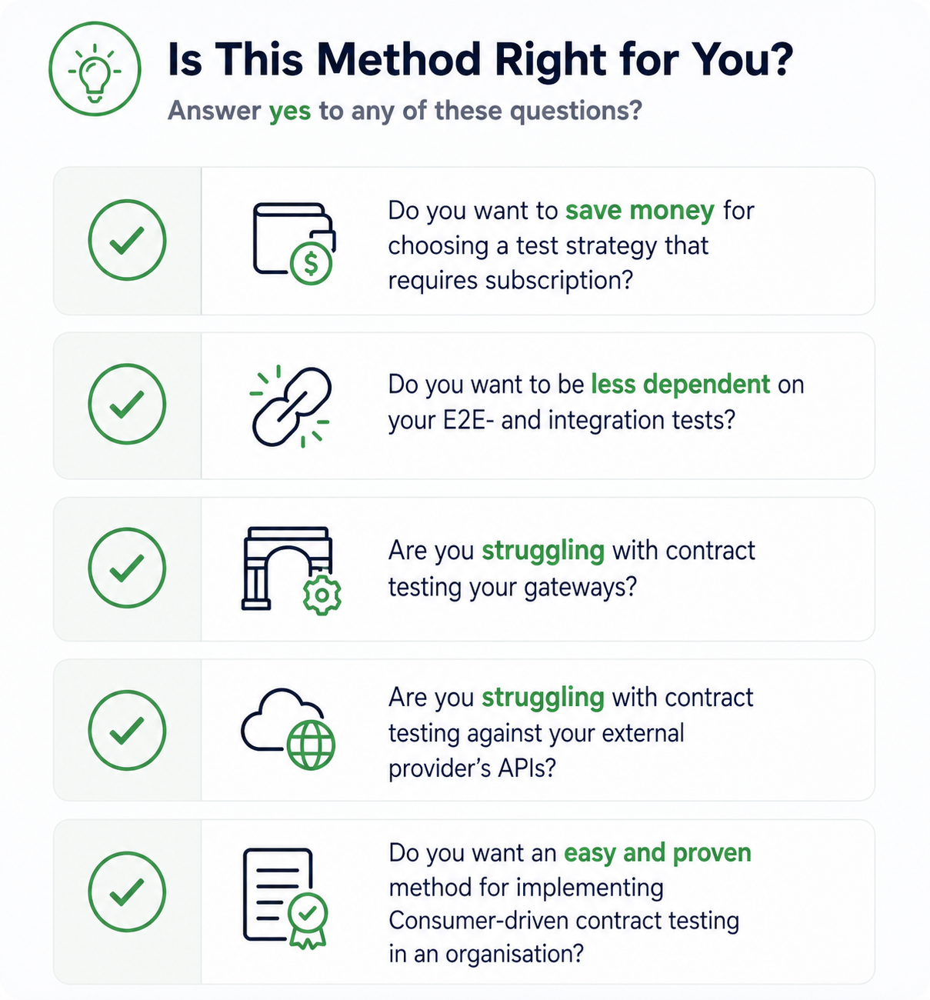

---
# Feel free to add content and custom Front Matter to this file.
# To modify the layout, see https://jekyllrb.com/docs/themes/#overriding-theme-defaults

layout: page
title: Welcome to Practical Pact - A Consumer Driven Contract Testing method.

---
This page serves the purpose of helping you determine if the method described in "Practical Pact - A Consumer Driven Contract Testing method" is relevant and suitable for your organisation. It provides a checklist to assess relevance, criteria for organisational fit, and guidance on when to use or avoid this method.

<!--## Is this method relevant for you?

- [ ] You want to reduce dependency on expensive testing tools  
- [ ] You rely heavily on E2E and integration tests  
- [ ] You face challenges testing through gateways  
- [ ] You need to test against external provider APIs  
- [ ] You lack a clear method for implementing CDCT in your organisation  -->

## Is this method right for your organization?
This method is a good fit if most of the following apply:

- You are using or planning to use a microservices architecture  
- You are a medium to large organization with multiple teams  
- You are using container-based infrastructure (e.g., Docker, Kubernetes)  
- You have the resources to introduce and maintain a new testing strategy  

If several of these do **not** apply:

- For monolithic systems → use traditional testing approaches  
- For small teams or simple systems → use Pact without additional extensions  
- For non-containerized environments → evaluate standard Pact capabilities first  
- If resources are limited → avoid introducing a new testing strategy at this time  

Additionally, you should have the following prerequisite knowledge to effectively implement this method:

Prerequisite knowledge

<ul>
  <li>Basic understanding of how APIs communicate (request/response, HTTP methods, payloads)</li>
  <li>Experience with testing APIs</li>
  <li>A development workflow that includes version control and CI/CD</li>
  <li>The ability to run and manage multiple services (e.g., using Docker or similar tools)</li>
</ul>

 

## When should you use this method?
You should consider this method if your organisation experiences one or more of the following:
- You rely heavily on end-to-end or integration tests that are slow, unstable, or difficult to maintain
- You want faster feedback in your CI/CD pipeline
- You have multiple services that communicate through APIs and need a reliable way to verify compatibility
- You find it difficult to manage contracts across API gateways or between frontend, gateway, and backend services
- You depend on external APIs and want a safer way to validate integrations without relying on full system tests
- You want a structured and practical approach to adopting Consumer-Driven Contract Testing (CDCT) in an organisation

## When should you NOT use this method?
This method is not suitable in the following cases:
- Your system is a monolith with limited or no service-to-service communication
- Your system has very few services and low integration complexity
- Your current testing setup is fast, stable, and provides sufficient feedback
- You do not have the resources to introduce and maintain a new testing approach

## What type of organisation is this for?
This method is designed for:
- Organisations using microservice architectures
- Teams working on multiple independent services
- Environments with CI/CD pipelines and API-based communication
- Smaller teams or simple systems can often adopt CDCT directly using existing tools such as Pact without additional structure.

